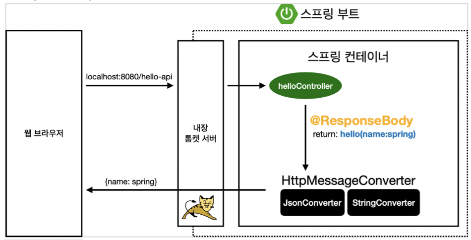

### @ResponseBody

@ResponseBody 어노테이션은 메서드의 리턴 값을 HTTP 응답 본문에 넣어준다. 이 경우 클래스의 정보는 Json 형태로 변환되어 HTTP 응답 본문에 넣어진다.

```java
import org.springframework.web.bind.annotation.RequestMapping;

@Controller
public class MyController {
    @RequestMapping("/hello")
    @ResponseBody
    public String hello() {
        return "Hello, World!";
    }

    @RequestMapping("/user")
    @ResponseBody
    public User user() {
        User user = new User();
        user.setName("John");
        user.setAge(20);
        return user;
    }
}

// ...

@NoArgConstructor
@Getter
@Setter
public class User {
    private String name;
    private int age;
}
```

위의 코드를 통해  다음과 같은 결과를 얻을 수 있다.

```bash
$ curl http://localhost:8080/hello
Hello, World!
$ curl http://localhost:8080/user
{"name":"John","age":20}
```

- 세부 사항

@ResponseBody를 어노테이션으로 붙이는 경우 그 응답을 HttpMessageConverter 통해서 직렬화하여 전달한다. 대략적으로 아래의 그림과 같은 과정을 거친다.



HttpMessageConverter는 스프링에서 제공하는 인터페이스로, 다양한 타입의 객체를 HTTP 응답 본문에 넣어줄 수 있도록 도와준다. 스프링은 기본적으로 다음과 같은 HttpMessageConverter를 제공한다.

- ByteArrayHttpMessageConverter
- StringHttpMessageConverter
- MappingJackson2HttpMessageConverter
- MappingJacksonHttpMessageConverter
- SourceHttpMessageConverter
- AllEncompassingFormHttpMessageConverter

@ResponseBody는 컨트롤러의 메소드 뿥만 아니라 클래스에도 붙일 수 있다. 이 경우, 컨트롤러가 지원하는 모든 메소드에 대해 @ResponseBody가 붙은 것과 같은 효과를 가진다. 이는 @RestController 어노테이션과 같은 효과를 가진다.
